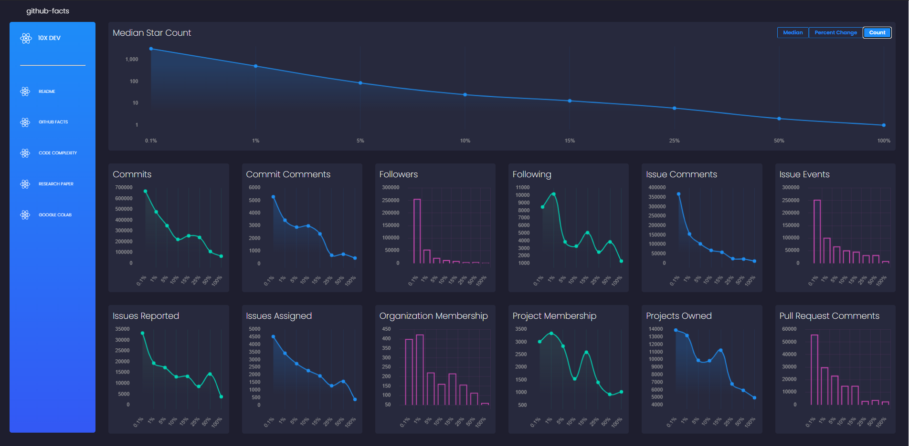

# [10x Developer](https://main.d308yhozibp3gs.amplifyapp.com/)
> Analyze the differences between highly starred developers and normal developers through the number of actions they take on GitHub (such as commit amount or projects owned). Also examine the code of top developers (such as the number of comments they make or total lines of code). 

## Table of contents
* [Technologies](#technologies)
* [Analysis Metrics](#code-examples)
* [General info](#general-info)
* [Contact](#contact)

## Technologies
* **Frontend**: HTML, CSS, JavaScript, React, styled-components
* **Backend**: Python, BigQuery, GitHub API

## Analysis Metrics
[GitHub Actions:](https://ghtorrent.org/relational.html)

> commits, commit_comments, followers, following, issue_comments, issue_events, issues_reporters, issues_assignees, organization_members, project_members, projects, pull_request_comments, pull_request_history, watchers

[Code Metrics:](https://radon.readthedocs.io/en/latest/intro.html)

> blank, bugs, calculated_length, comments, complexity, difficulty, effort, length, logical lines of code (lloc), lines of code (loc), multi-line strings (multi), single_comments, source lines of code (sloc), time, vocabulary, volume

## General info

### Planning
This was a research project I did with my professor. He gave me some guidance when I had meetings with him. For example, he told me me about a dataset called **GHTorrent** that contains all types of information about GitHub users, archiving every single fact and user. It contained commits, projects, users, issues, stars, followers, and other important facts that I used in my research. He also told me to consider if code created from an 10x developer is different from the normal developer and informed me about code complexity. One obvious example is the number of lines of code. Another is the number of conditionals: `if / else`. There are some factors that researchers disagree on, but in general, code can be numerically more complex than others based on what code metric you use. 

With this, I found this library called **Radon**, which is able to tell you if code is more complex, and by what factors. However, I saw that Radon can only analyze **Python** code, not any other language. I thought this would've been a *huge* problem because I would be creating a lot of bias in choosing a certain language. However, my professor told me it was perfectly fine because the Python community was still huge. I just needed to specify I'm only comparing with that language when I publish research on it. 

Finally I realized that I could use **BigQuery** in order to do any SQL queries that I need to do. At first, I thought I would need to download all the data locally and mess with them myself. However, I saw that **GHTorrent** dataset was already on on **BigQuery**. This was extremely convinent because I've been dabbling with **BigQuery** previously and had experience with it.

### "10x Developer" Metrics
Although I planned all the resources I need, I still needed to consider who's a 10x developer. At first, I thought maybe I should go by the number of followers they had on GitHub. However, I quickly saw that this was a bad metric because a lot of "popular" developers, ones that have huge social followings, tend to have lots of followers. They aren't necessarily the most expert developers, and they only got their followers from their YouTube channels (ex: Siraj Raval). I tried another metric, using the number of times a user got starred, and this too led to a popularity contest. Finally, I found a metric that worked best. I decided to accumulate all the stars that a user has from *each* repo they had. This was an excellent indicator of a 10x developer because when a user stars a repo, it typically means they enjoyed it or that it was at least a good resource. For example, Kenneth Reitz ended up being the top starred Python user because he's contributed to many Python repos that are used in the community (ex: `requests, pipenv, requests-html`). 

### Initial Attempts
Before this project, I didn't even know how to use SQL! So I had no idea how I was suppose to query all the Python users on GHTorrent and accumulate their different star counts. Instead, I improvised and found a website that contained the top Python users by stars. I then webscraped the users and their count using **BeautifulSoup**. This was all and well, but I found out that I *still* needed to get the normal developers and their facts from GHTorrent. So I learned SQL on my own and gathered all the Python users on GHTorrent.

### Problems...

#### Loading Times
However, I saw that there was immediate problems. One is that web scraping off a website took **forever**. Every time I tried to webscrape 1000 top developers off the website, it took almost a minute. This took far too long so I had to serialize the data so I can just load it.

#### Bad Sampling
Another problem is that trying to do an analysis between the top 1000 developers is not good enough. Ideally, we want to have a sample of all different types of developers, such as the top 10% or top 25%. So I had to totally scrap the entire web scraping method. Instead I learned how to use SQL by myself to learn find the star count of *any* developer. This took forever to learn because I had to grab the star counts of every repo, find out if they're in Python, and link them back to the same user.

#### Resource Management
Another problem that I quickly noticed was that I was trying to query literally over a 1 TB of data on BigQuery (100,000s of commits, commit messages, users, etc.). I quickly hit my limited number of queries I can make. Instead, I had to drop pieces of data that were irrelevant, such as location (longitude, latitude).

I also hit my API limit on GitHub. I saw that when I tried to search for every Python repo from a user, it would take roughly ~50 calls. I had to authenticate my account so that I can reach the higher 5000 API call limit. Even then, I manually waited every hour so I can sample more users. In total, I was only able to do 100 users / hour.

#### Version mismatch
Finally, another bug I spent days debugging was with Radon. Whenever I ran several repos through Radon, I would frequently get a bug or issue. I found out it was because Radon doesn't work with Python 2! So I had to add another step when I was count star counts, which was to skip Python 2 repos. 

#### Bad Data
Some of the data on GHTorrent was outdated. There were some users who didn't exist. Some projects didnt exist. Sometimes you couldn't find the repos of a certain user because they deleted it! I essentially had to check for bad data every step in the process. Some users were actually organizations.

### Results
I found out that identifying issues and resolving them were the biggest signs of a 10x developer. For example, the top 0.1% had a nearly 5000% increase in the number of issues events they have (creating, assigning, closing, etc.). Pull requests were huge also, with 3000%. I hypothesized that it was because great repos constantly have issues being identified, with lots of pull requests to resolve those issues. Surprisingly, the number of commits didn't matter at much at 2000%. Projects owned was even lower at 350%. This indicates that code output isn't as important as making all repos removed of issues.

### What can be improved
Sadly when I was comparing the code with 10x developers vs normal ones, the code metrics seemed to be roughly equal. It's likely because a lot of Python repos reuse the same Python libraries. In the future, I may try to handpick these samples.

### What I learned
Although this project was extremely complex, I learned so much from it. I learned how to use BigQuery, API's, webscraping, resource management, data handling, and statistics. I also realized that I shouldn't just go into a project haphazardly without at least planning it beforehand. If I'm going to be working with literal TB's of data, then there should be structure to how you do something. I can spend forever going on about the bugs and details, but this was the largest and funnest endeavor I ever took!

## Contact
Created by [@spencerpham](https://www.spencerpham.dev/) - feel free to contact me!

